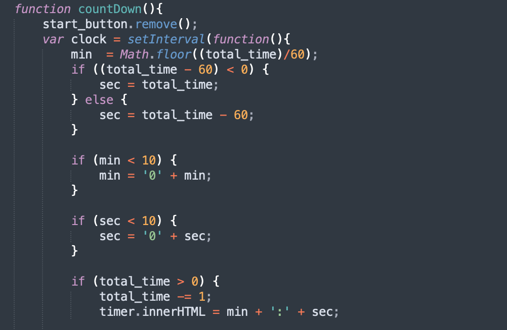

# Code Quiz
I was tasked to make a code quiz from scratch using html,css and javascript. 

## Coding Process
This project had no starter code, so my first steps were to initiate all the files that I would be using, additionally 
adding in all the links to ensure all files were connected to the main index.html file. I first tackled the task of creating 
a timer for the quiz. Using setInterval, I was able to create a timer, however it was not formatted the way I wanted. So I used modulo and floor division 
to calculate the minute and hour.  Afterwards I created all the different arrays of questions, selections, and answers. In order to change the information on the test, I went throguh a list of different questions and dynamically added them. Furthermore, I stored the user selection and would check if it was in the solutions list. If it was not then they would lose 10 seconds. Furthermore, regardless of right or wrong the button would change the content of the quiz. After reaching the end, I created a function for the ending of the game. At the end, I want to be able to stop the timer and record the information gained during the test. Information such as how many questions the user got correct. Furthermore, I had to find a way of recording user input for their name to record their score locally. I stored the information through using objects. With the stored information I was able to retrieve it form the local storage and display it on a list of plays with a a certain number of points. The player can at anytime reset the scoreboard. 

### Built With 
* [CSS](https://www.w3schools.com/css/)
* [HTML](https://www.w3schools.com/html/)
* [Javascript](https://developer.mozilla.org/en-US/docs/Web/JavaScript)

### Deployed Link
https://danielvo1.github.io/code_quiz/

## Authors
* **Daniel Vo** 
- [Link to Portfolio Site](https://danielvo1.github.io/daniels_portfolio/)
- [Link to Github](https://github.com/)